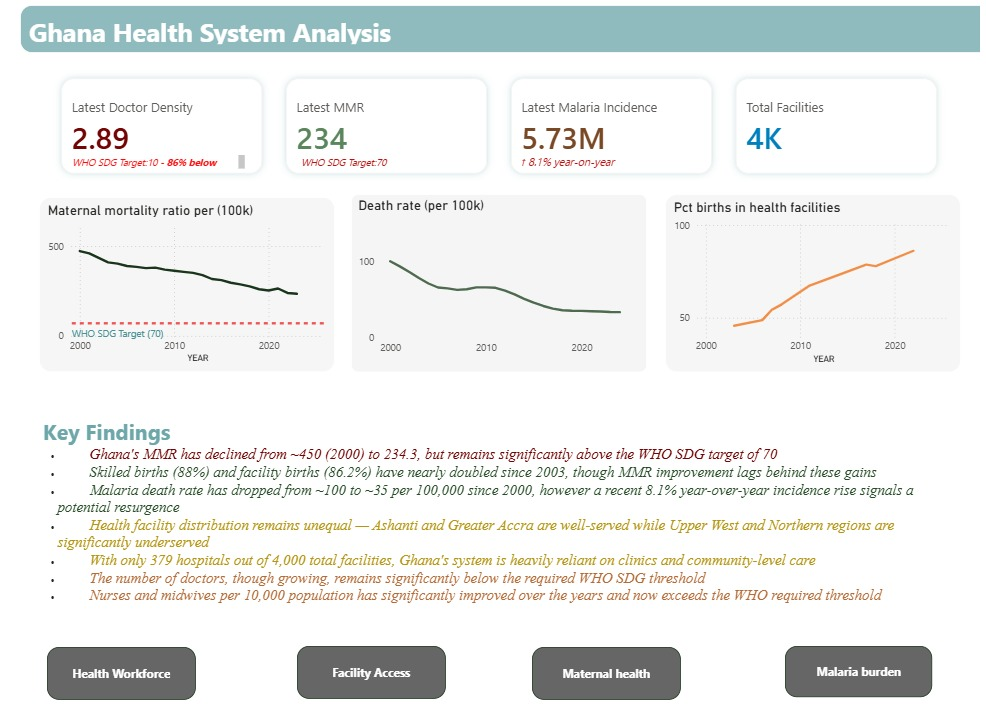

# Ghana Health System Analysis

## Overview
Multi-page Power BI report analysing Ghana's health system using real data from
the Ghana Health Service, WHO, and World Bank. Built to identify regional
disparities in facility access, malaria burden trends, and workforce gaps.

## Live Report
[View the live Power BI report here](https://app.powerbi.com/links/1TN22lENyD?ctid=5fd2e818-0584-4c80-af15-6c19035e30b9&pbi_source=linkShare)

## Data Sources
- Ghana Health Facilities: kaggle.com/datasets/citizen-ds-ghana/health-facilities-gh
- WHO Ghana Health Indicators: data.humdata.org/dataset/who-data-for-gha
- World Bank Ghana Health Data: data.humdata.org/dataset/world-bank-health-indicators-for-ghana

## Tools
Excel 2024 | Power Query | Power BI Desktop | DAX | GitHub

## Key Findings
- Maternal mortality fell from ~450 (2000) to 234.3, still above the WHO SDG target (70)
- Skilled (88%) and facility births (86.2%) have nearly doubled, but MMR decline is slower
- Malaria deaths dropped (~100 → ~35 per 100k), but cases recently rose by 8.1%
- Health facilities are unevenly distributed (urban regions better served than northern regions)
- Only 379 of ~4,000 facilities are hospitals — heavy reliance on clinics
- Doctor numbers remain below WHO targets
- Nurses and midwives now exceed the WHO-recommended level

## Policy Recommendations
1. Prioritise new CHPS compounds in Northern, Savannah, and Upper regions
2. Investigate the cause of the 2023 malaria spike and scale up ITN distribution
3. Increase skilled birth attendance training to close the facility delivery gap

## Dashboard Preview

